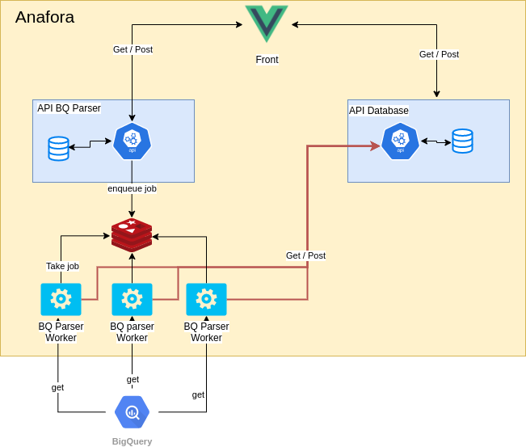

# Anafora

Anafora is a BigQuery data catalog that get all informations about BigQuery datasets and tables. The front is write in Vuejs and backend in Python.

# Architecture

# How to launch

You can find in each folder (front, bq_parser, api_database) a README.MD that explain how to launch allm different parts of Anafora.

# Missing features

- Incremental load, actually to update the list of Tables in one Datasets, you need to parse all tables, that can be long. A good feature will be to add/delete only new table.
- Delete informations: If a Dataset or Table is delete in BigQuery Anafora doesn't update its database.
- Stop task in worker. If an task is send to worker and is in running you can't stop it.